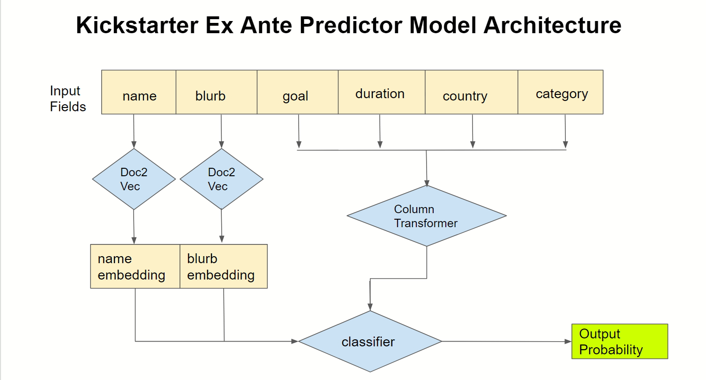

# Model API
The model API takes a JSON POST string and serves a prediction of probabilty of success. Here's our model architecture.


Reference-style: 
![alt text][logo]

The expected JSON POST format is:
`{'name': string, 'blurb': string, 'goal': float, 'country': string(2), 'duration': float, 'category': string,}`

Prediction will be returned in this JSON format:
`{'pred': float}`

Here's an example command:
```
curl -X POST -H "Content-Type: application/json" -d '{"name": "This is a test Kickstarter header", "blurb": "This is an example description of a kickstarter project to test for the API. I would like to thank my wife, parents, and all my loving family members for this to work. I would also like to thank all the Kickstarter team members and project leads for making this possible.", "goal": 800.0, "country": "US", "duration":15.0, "category": "fashion"}' http://127.0.0.1:5000/predict
```

A sample command of very high success percentage would be:
```
curl -X POST -H "Content-Type: application/json" -d '{"name": "This is a test Kickstarter header", "blurb": "This is an example description of a kickstarter project to test for the API. I would like to thank my wife, parents, and all my loving family members for this to work. I would also like to thank all the Kickstarter team members and project leads for making this possible.", "goal": 2011.0, "country": "US", "duration":67.0, "category": "publishing"}' http://127.0.0.1:5000/predict
```

Here's an example comand with high success probability
```curl -X POST -H "Content-Type: application/json" -d '{"goal": 2011.0, "country": "US", "duration":67.0, "category": "publishing"}' http://127.0.0.1:5000/predict```


## Directory Structure:
```
<<<<<<< HEAD
├── README.md
│
├── api                <- Model serving app
│
├── data               <- Not on github      
│    ├── processed     <- The final, canonical data sets for modeling.
│    └── raw           <- The original, immutable data dump.
│
├── notebooks          <- Jupyter notebooks
│
├── reports            <- Generated analysis as HTML, PDF, LaTeX, etc.
│    |
│    └── figures       <- Generated graphics and figures to be used in reporting
│
├── weights            <- Trained and serialized models, model predictions, or model summaries
=======
├── README.md          
├── data               <- Stored locally, not uploaded to github
│
├── api                <- Model RestAPI using Flask
│
├── other_app          <- Luc's playground
│
├── models             <- Trained and serialized models
│
├── notebooks          <- Jupyter notebooks. 
>>>>>>> e07bf486807449e17e6c4164106bd7a5f4a6e348
│
├── Pipfile
│
├── Dockerfile
│
└── requirements.txt
```
## Change log:
<<<<<<< HEAD
2019-11-08 - Han - Organized project directory.
=======
2019-10-23 - Han - Modeled with full app features. 0.69 accuracy. Deployed RestAPI.

2019-10-23 - Han - Done text embedding modeling. Onward to modeling with full features.

2019-10-22 - Han - Change the RestAPI to serving a probability of success instead of just saying success or not.
>>>>>>> e07bf486807449e17e6c4164106bd7a5f4a6e348

2019-10-22 - Luc - Added one naive model notebook, model accuracy of .86

2019-10-21 - Han - Deployed using ngrok tunneling for front/backend to test.

2019-10-21 - Han - Made RestAPI with Flask and format. Tested locally.

2019-10-21 - Han - Added EDA and two naive model notebooks. Created a model 0.68 accuracy.  

2019-10-21 - Han - Setup project structure.
